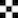
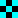

# 101 on OpenCV

## Approach

Goal of this document is to introduce OpenCV.  
The approach is very pragmatic, no math involved, just learning to apply and OpenCV through code.

## Wat is Computer Vision

Computer Vision is the area within "Computer Science" focussing on:

* Extraction en analysis of information from images and videos's
* Structuring and interpreting this information
* Manipulation, enrichment and annotation of images
* Identification of objects and patterns with images

In other words "computer vision" is a set of patterns, practices and algorithms used 
to implement this.

## Installatie OpenCV

For this mini-course python3 is required.  
2 **dependencies** needs to be installed through pip (or other tools like anaconda...)

~~~
$ pip install opencv-contrib-python
pip install numpy
~~~

## Basisprincipes

Image al numpy array

1 kanaal heeft 8 bit kleurendiepte
1 pixel == 3 bytes of 24 bit

1 vs 3 kanalen
rgb vs bgr

Basis: lezen en schrijven

Image uitlezen
Image tonen
Image wegschrijven
Video uitlezen
Video wegschrijven

## Reading and writing with OpenCV

We start with the basics being reading and writing of images through OpenCV. 

First off we read out a grey/white file.  

~~~python
import cv2 as cv

img = cv.imread("checkerboard_18x18.png", cv.IMREAD_UNCHANGED)
print(type(img))
print(img.shape)
~~~

As you see it concerns a numpy-array with a dimension of 18 by 18

~~~
<class 'numpy.ndarray'>
(18, 18)
~~~

If we print the content...

~~~python
import cv2 as cv

img = cv.imread("checkerboard_18x18.png", cv.IMREAD_UNCHANGED)

for line in img:
    for element in line:
        print(str(element).ljust(3), end=" ")
    print()
~~~

...you'll see the **white blocks** containing the value **255** and the 
**black blocks 0**

~~~
0   0   0   0   0   0   255 255 255 255 255 255 0   0   0   0   0   0   
0   0   0   0   0   0   255 255 255 255 255 255 0   0   0   0   0   0   
0   0   0   0   0   0   255 255 255 255 255 255 0   0   0   0   0   0   
0   0   0   0   0   0   255 255 255 255 255 255 0   0   0   0   0   0   
0   0   0   0   0   0   255 255 255 255 255 255 0   0   0   0   0   0   
0   0   0   0   0   0   255 255 255 255 255 255 0   0   0   0   0   0   
255 255 255 255 255 255 0   0   0   0   0   0   255 255 255 255 255 255 
255 255 255 255 255 255 0   0   0   0   0   0   255 255 255 255 255 255 
255 255 255 255 255 255 0   0   0   0   0   0   255 255 255 255 255 255 
255 255 255 255 255 255 0   0   0   0   0   0   255 255 255 255 255 255 
255 255 255 255 255 255 0   0   0   0   0   0   255 255 255 255 255 255 
255 255 255 255 255 255 0   0   0   0   0   0   255 255 255 255 255 255 
0   0   0   0   0   0   255 255 255 255 255 255 0   0   0   0   0   0   
0   0   0   0   0   0   255 255 255 255 255 255 0   0   0   0   0   0   
0   0   0   0   0   0   255 255 255 255 255 255 0   0   0   0   0   0   
0   0   0   0   0   0   255 255 255 255 255 255 0   0   0   0   0   0   
0   0   0   0   0   0   255 255 255 255 255 255 0   0   0   0   0   0   
0   0   0   0   0   0   255 255 255 255 255 255 0   0   0   0   0   0  
~~~

### Black and white: 1 pixel -> 1 byte

Basically in black and white image you have one byte per pixel...  
If we change our program to use a file with more differences

~~~python
import cv2 as cv

img = cv.imread("checkerboard_fuzzy_18x18.jpeg", cv.IMREAD_GRAYSCALE)

for line in img:
    for element in line:
        print(str(element).ljust(3), end=" ")
    print()
~~~

... you'll see other value's depending on the greyscale

~~~
0   0   15  20  1   134 233 253 253 253 255 229 130 1   29  2   0   0   
0   1   5   18  0   137 232 255 254 247 255 228 129 0   24  2   0   0   
7   5   2   28  2   139 230 254 255 249 255 226 128 0   27  3   2   2   
25  27  28  38  0   129 236 255 253 249 251 227 129 0   36  27  27  27  
2   0   0   4   2   130 239 254 254 254 255 230 126 0   4   2   0   0   
132 129 131 124 121 163 211 226 227 225 226 203 164 125 125 129 131 131 
234 227 230 229 232 205 151 115 125 124 117 156 205 232 229 225 228 228 
254 255 255 251 255 222 102 1   0   0   0   120 225 255 254 255 255 255 
254 255 254 255 253 225 104 0   50  46  0   120 233 254 247 253 251 253 
252 250 250 253 254 223 105 2   45  50  0   127 223 255 251 255 251 253 
254 255 255 252 255 226 104 0   1   1   0   120 229 255 255 254 255 255 
233 235 231 233 234 207 142 106 108 102 108 146 207 235 237 232 231 231 
132 132 131 132 130 175 207 223 224 224 224 210 165 134 130 136 134 134 
1   1   3   0   0   129 238 255 254 252 255 233 126 0   0   0   0   0   
20  19  30  40  5   130 236 253 252 249 255 224 129 0   39  23  21  21  
12  6   7   27  0   131 234 255 254 250 254 230 123 1   28  5   10  10  
0   0   9   22  1   133 233 255 253 253 254 230 129 1   26  2   0   0   
0   0   9   22  1   132 233 255 253 253 254 230 129 1   26  2   0   0  
~~~

### Color: 3 channels per pixel -> 3 bytes/pixel

The number of bits is different with in color scheme.  
If we use the following image

And ask it through the following code...

~~~python
import cv2 as cv

img = cv.imread("checkerboard_18x18_blue.png")
print(img.shape)
print()

for line in img:
    for element in line:
        print(str(element).ljust(15), end=" ")
    print()
~~~

...we obtain a larger array  
For a starter we see that each pixes contains of 3 bytes.

~~~
(18, 18, 3)

[255 255   0]   [255 255   0]   [255 255   0]  ...
[255 255   0]   [255 255   0]   [255 255   0]  
[255 255   0]   [255 255   0]   [255 255   0]  
[255 255   0]   [255 255   0]   [255 255   0]  
[255 255   0]   [255 255   0]   [255 255   0]  
[255 255   0]   [255 255   0]   [255 255   0]  
[0 0 0]         [0 0 0]         [0 0 0]        
[0 0 0]         [0 0 0]         [0 0 0]        
[0 0 0]         [0 0 0]         [0 0 0]        
[0 0 0]         [0 0 0]         [0 0 0]        
[0 0 0]         [0 0 0]         [0 0 0]        
[0 0 0]         [0 0 0]         [0 0 0]  
...         
~~~

## Uitlezen en eigenschappen

~~~python
import cv2 as cv
import numpy as np
import os

for name in filter(lambda x: x.endswith((".jpeg", ".jpg", ".png")), os.listdir()) :
# for name in [x for x in os.listdir() if x.endswith((".jpeg", ".jpg", ".png"))] :
    img = cv.imread(name)
    height, width, channels = img.shape
    print(f"Het type van image is {img.dtype}")
    print(f"File with name {name} is {height} px high and {width} px wide and contains {channels} channels")
~~~

## List all files

~~~python
import cv2 as cv
import numpy as np
import os

for name in filter(lambda x: x.endswith((".jpeg", ".jpg", ".png")), os.listdir()) :
    img = cv.imread(name)
    height, width, channels = img.shape
    description = f"File with name {name} is {height} px high and {width} px wide and contains {channels} channels"
    print(description)
    cv.imshow(description, img)

cv.waitKey(0)
~~~

### Reading as grey

~~~python
image = cv.imread("cuca.jpeg", cv.IMREAD_GRAYSCALE)
print(image.shape)
cv.imshow("grey", image)
cv.waitKey(0)
~~~

~~~python
import cv2 as cv
import numpy as np

image = cv.imread("cuca.jpeg")
grey_image = cv.cvtColor(image, cv.COLOR_BGR2GRAY)
cv.imwrite("cuca_grey.png", grey_image)
cv.imwrite("cuca_grey.jpeg", grey_image)
~~~

~~~python
import cv2 as cv
import numpy as np

image = cv.imread("cuca_grey.png")
print(image.shape)
image = cv.imread("cuca_grey.jpeg")
print(image.shape)
cv.imshow("grey", image)
cv.waitKey(0)
~~~

Echter by default als BGR...
Flags

Er bestaan,

* cv2.IMREAD_GRAYSCALE or 0: Loads image in grayscale mode
* cv2.IMREAD_COLOR or 1: Loads a color image. Any transparency of image will be neglected. It is the default flag.
* cv2.IMREAD_UNCHANGED or -1: Loads image as such including alpha channel.

~~~
import cv2 as cv
import numpy as np

image = cv.imread("cuca_grey.png", cv.IMREAD_UNCHANGED)
print(image.shape)
image = cv.imread("cuca_grey.jpeg", cv.IMREAD_UNCHANGED)
print(image.shape)
cv.imshow("grey", image)
cv.waitKey(0)
~~~

## Opletten met matplotlib rgb vs bgr

~~~python
import matplotlib.pyplot as plt

image = cv.imread("cuca.jpeg")
plt.imshow("test", image)
~~~

## Aanmaken

~~~python
import cv2 as cv
import numpy as np

black_surface = np.zeros((500,500,3), 'uint8')
white_color = [0xff, 0xff, 0xff]
black_surface[100:400 , 100:400] = white_color

cv.imshow("Checkboard", black_surface)
cv.waitKey(0)
~~~

## Opslaan van 

~~~python
import cv2 as cv
import numpy as np

black_surface = np.zeros((500,500,3), 'uint8')
white_color = [0xff, 0xff, 0xff]
black_surface[100:400 , 100:400] = white_color

cv.imwrite("surface.jpg", black_surface)
cv.imwrite("surface.png", black_surface)
~~~

## Ophalen en tonen 

~~~python
import cv2 as cv
import numpy as np

image1 = cv.imread("surface.jpg")
image2 = cv.imread("surface.png")

cv.imshow("surface.jpg", image1)
cv.imshow("surface.png", image2)
~~~

### Leuker voorbeeld

~~~python
import cv2 as cv
import numpy as np

black_surface = np.zeros((500,500,3), 'uint8')
white_color = [0xff, 0xff, 0xff]

for i in range(0,5):
    for j in range(i % 2,5,2):
        black_surface[i * 100:(i*100) + 100 , j*100 : (j*100) + 100] = white_color

cv.imshow("Checkboard", black_surface)
cv.waitKey(0)
~~~

### Leuker voorbeeld met opencv support

~~~python
import cv2 as cv
import numpy as np

black_surface = np.zeros((500,500,3), 'uint8')
white_color = [0xff, 0xff, 0xff]

for i in range(0,500,100):
    for j in range(((i // 100) % 2) * 100,500,200):
        points = np.array([[j, i], [j, i + 99],[j+99, i + 99] ,[j + 99, i]])
        cv.fillPoly(black_surface, pts=[points], color=white_color)

cv.imshow("Squares", black_surface)
cv.waitKey(0)
~~~

### Volgorde is belangrijk echter (ruitjes tekenen)

~~~python
import cv2 as cv
import numpy as np

black_surface = np.zeros((500,500,3), 'uint8')
red_color = [0x0, 0x0, 0xff]

for i in range(0,500,100):
    for j in range(0,500,100):
        points = np.array([[j, i], [j, i + 100], [j + 100, i], [j+100, i + 100]])
        cv.fillPoly(black_surface, pts=[points], color=red_color)

cv.imshow("Squares", black_surface)
cv.waitKey(0)
~~~

### Efficienter werken

~~~python
import cv2 as cv

black_surface = np.zeros((500,500,3), 'uint8')
white_color = [0xff, 0xff, 0xff]

for i in range(0,500,100):
    for j in range(((i // 100) % 2) * 100,500,200):
        cv.rectangle(black_surface, (j, i),(j+99, i + 99), white_color)

cv.imshow("Squares", black_surface)
cv.waitKey(0)
~~~

Nu met vulling...

~~~python
import cv2 as cv

black_surface = np.zeros((500,500,3), 'uint8')
white_color = [0xff, 0xff, 0xff]

for i in range(0,500,100):
    for j in range(((i // 100) % 2) * 100,500,200):
        cv.rectangle(black_surface, (j, i),(j+99, i + 99), white_color, thickness=-1)

cv.imshow("Squares", black_surface)
cv.waitKey(0)
~~~

### Driehoekjes tekenen

~~~python
import cv2 as cv
import numpy as np

black_surface = np.zeros((500,500,3), 'uint8')
red_color = [0x0, 0x0, 0xff]

for i in range(0,500,100):
    for j in range(0,500,100):
        points = np.array([[j + 50, i], [j, i + 100], [j + 100, i + 100]])
        cv.fillPoly(black_surface, pts=[points], color=red_color)

cv.imshow("Triangles", black_surface)
cv.waitKey(0)
~~~

### Lijntjes tekenen

~~~python
import cv2 as cv
import numpy as np

black_surface = np.zeros((500,500,3), 'uint8')
white_color = [0xff, 0xff, 0xff]

cv.line(black_surface, (0,0), (500,500), white_color, thickness=5)
cv.line(black_surface, (0,500), (500,0), white_color, thickness=5)

cv.imshow("Lines", black_surface)
cv.waitKey(0)
~~~

### Circel bijtekenen

~~~python
import cv2 as cv
import numpy as np

black_surface = np.zeros((500,500,3), 'uint8')
white_color = [0xff, 0xff, 0xff]

cv.line(black_surface, (0,0), (500,500), white_color, thickness=5)
cv.line(black_surface, (0,500), (500,0), white_color, thickness=5)

cv.circle(black_surface, (250,125), 75, white_color)
cv.circle(black_surface, (250,375), 75, white_color)

cv.imshow("Lines", black_surface)
cv.waitKey(0)
~~~

### Text bijtekenen

~~~python
import cv2 as cv
import numpy as np

black_surface = np.zeros((500,500,3), 'uint8')
white_color = [0xff, 0xff, 0xff]

cv.putText(blank, "Hello", (0,250), cv.FONT_HERSHEY_TRIPLEX, 1, (255,0,0))

cv.line(black_surface, (0,0), (500,500), white_color, thickness=5)
cv.line(black_surface, (0,500), (500,0), white_color, thickness=5)

cv.circle(black_surface, (250,125), 75, white_color)
cv.circle(black_surface, (250,375), 75, white_color)

cv.imshow("Lines", black_surface)
cv.waitKey(0)
~~~

## Size

### Rescale

### Rescale

Try one

~~~python
import cv2 as cv

img = cv.imread("tennis.jpg")
scale = 0.50
width = int(img.shape[1] * scale)
height = int(img.shape[0])
# !! swap of position width and heigth for resizing
dimensions = (width, height)
resized = cv.resize(img, dimensions, interpolation=cv.INTER_AREA)
cv.imshow(f"Resized from {img.shape} to {resized.shape}", resized)
cv.waitKey(0)
~~~

~~~python
import cv2 as cv

img = cv.imread("tennis.jpg")
scale = 0.50
width = int(img.shape[1] * scale)
height = int(img.shape[0] * scale)
# !! swap of position width and heigth for resizing
dimensions = (width, height)
resized = cv.resize(img, dimensions, interpolation=cv.INTER_AREA)
cv.imshow(f"Resized from {img.shape} to {resized.shape}", resized)
cv.waitKey(0)
~~~

~~~python
import cv2 as cv

img = cv.imread("cuca.jpeg")
scale = 0.50
width = int(img.shape[1] * scale)
height = int(img.shape[0] * scale)
# !! swap of position width and heigth for resizing
dimensions = (width, height)
resized = cv.resize(img, dimensions, interpolation=cv.INTER_AREA)
cv.imshow(f"Resized from {img.shape} to {resized.shape}", resized)
cv.waitKey(0)
~~~

### Cropping

~~~python
import cv2 as cv

img = cv.imread("cuca.jpeg")

start_y = 350
end_y = 1300
start_x = 350
end_x = 1700

cropped = img[start_y:end_y, start_x:end_x]

cv.imshow("Cropped", cropped)
cv.waitKey(0)
~~~

### Blurring and outlining

~~~python
import cv2 as cv

img = cv.imread("d.jpeg")

start_y = 350
end_y = 1300
start_x = 350
end_x = 1700

canny = cv.Canny(img, 125,175)
blur = cv.GaussianBlur(img, (3,3), cv.BORDER_DEFAULT)
canny_blur = cv.Canny(blur, 125,175)

cv.imshow("img", img)
cv.imshow("canny", canny)
cv.imshow("blur", blur)
cv.imshow("cannyBlur", canny_blur)
dilated = cv.dilate(canny_blur,(3,3), iterations=1)

cv.waitKey(0)
~~~

### Rotating

~~~python
import cv2 as cv
import numpy as np

blank = np.zeros((500,500,3), 'uint8')
blank[:] = 0, 255, 0

cv.circle(blank, (250,250), 250, (0,0,0))
cv.line(blank, (250,0), (250,500), (255,0,0), thickness=20)
cv.putText(blank, "Hello", (0,250), cv.FONT_HERSHEY_TRIPLEX, 1, (255,0,0))

rows,cols,ch = blank.shape
print(rows, cols)
 
pts1 = np.float32([[50,50],[200,50],[50,200]])
pts2 = np.float32([[10,100],[200,50],[100,250]])
M = cv.getAffineTransform(pts1,pts2)
 
dst = cv.warpAffine(blank,M,(cols,rows))
print(cv.getRotationMatrix2D((200,200), 90, 1.0))
#dst = cv.warpAffine(blank,cv.getRotationMatrix2D((200,200), 90, 1.0),(cols,rows))

cv.imshow("dst", dst)

cv.waitKey(0)
~~~

### Video

~~~python
import cv2 as cv
   
video = cv.VideoCapture(4) 
if (video.isOpened() == False):  
    print("Error reading video file") 
  
frame_width = int(video.get(3)) 
frame_height = int(video.get(4)) 
   
size = (frame_width, frame_height) 
   
result = cv.VideoWriter('filename.avi',  
                         cv.VideoWriter_fourcc(*'MJPG'), 
                         24, size) 
    
while(True): 
    ret, frame = video.read() 
  
    if ret == True:  
        result.write(frame) 
        cv.imshow('Frame', frame) 
        if cv.waitKey(1) & 0xFF == ord('s'): 
            break
    else: 
        break
  
video.release() 
result.release() 
    
cv.destroyAllWindows() 
~~~

### Tracking

~~~python
import cv2 as cv

def draw_rectangle(frame, bbox):
    p1 = (int(bbox[0]), int(bbox[1]))
    p2 = (int(bbox[0] + bbox[2]), int(bbox[1] + bbox[3]))
    cv.rectangle(frame, p1, p2, (255, 0, 0), 2, 1)

def draw_text(frame, txt, location, color=(50, 170, 50)):
    cv.putText(frame, txt, location, cv.FONT_HERSHEY_SIMPLEX, 1, color, 3)

video_input_file_name = "race_car.mp4"
video_output_file_name = "race_car-tracked.mp4"
   
video = cv.VideoCapture(video_input_file_name)

ok, frame = video.read()

width = int(video.get(cv.CAP_PROP_FRAME_WIDTH))
height = int(video.get(cv.CAP_PROP_FRAME_HEIGHT))

video_out = cv.VideoWriter(video_output_file_name, cv.VideoWriter_fourcc(*"XVID"), 10, (width, height))

bbox = (1300, 405, 160, 120)
tracker = cv.TrackerKCF.create()
tracker.init(frame, bbox)

while True:
    ok, frame = video.read()
    if not ok:
        break
    _, bbox = tracker.update(frame)
    draw_rectangle(frame, bbox)
    video_out.write(frame)

video.release()
video_out.release()

print("done")
~~~

### Object detection

~~~python
import os
import cv2 as cv

classFile  = "coco_class_labels.txt"
with open(classFile) as fp:
    labels = fp.read().split("\n")

modelFile  = os.path.join("models", "ssd_mobilenet_v2_coco_2018_03_29", "frozen_inference_graph.pb")
configFile = os.path.join("models", "ssd_mobilenet_v2_coco_2018_03_29.pbtxt")

net = cv.dnn.readNetFromTensorflow(modelFile, configFile)

def detect_objects(net, im, dim = 300):
    blob = cv.dnn.blobFromImage(im, 1.0, size=(dim, dim), mean=(0, 0, 0), swapRB=True, crop=False)
    net.setInput(blob)
    objects = net.forward()
    return objects

def display_objects(im, objects, selection=labels, threshold=0.25):
    rows, cols, _ = im.shape
    print(objects.shape)

    # For every Detected Object
    for i in range(objects.shape[2]):
        # Find the class and confidence
        selected = objects[0, 0, i]
        
        classId = int(selected[1])
        score = float(selected[2])

        x = int(selected[3] * cols)
        y = int(selected[4] * rows)
        w = int(selected[5] * cols - x)
        h = int(selected[6] * rows - y)

        if score > threshold and labels[classId] in selection:
            cv.rectangle(im, (x, y), (x + w, y + h), (255, 0, 0 ), 2)

    cv.imshow("result", im)

im = cv.imread(os.path.join("lou_en_cuca.jpeg"))
objects = detect_objects(net, im)
print(len(objects))

display_objects(im, objects, selection=["dog"])

cv.waitKey(0)
~~~

